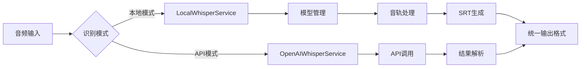

# Whisper语音识别实现分析报告

## 1. 参考项目核心实现分析（TelegramSearchBot）

### 1.1 语音识别核心逻辑
```csharp
// 模型管理
if (!File.Exists(modelPath)) {
    await DownloadModelAsync(ggmlType, modelName, modelsDir);
}
using var whisperFactory = WhisperFactory.FromPath(modelPath);

// 处理器配置
await using var processor = whisperFactory.CreateBuilder()
    .WithThreads(16)
    .WithLanguageDetection()
    .Build();

// 音频处理
await foreach (var result in processor.ProcessAsync(wavStream, token)) {
    // 结果处理
}
```

### 1.2 SRT字幕生成实现
```csharp
var ToReturn = new List<string>();
await foreach (var result in processor.ProcessAsync(wavStream, token)) {
    ToReturn.Add($"{startId}");
    ToReturn.Add($"{result.Start.ToString(@"hh\:mm\:ss\,fff")} --> {result.End.ToString(@"hh\:mm\:ss\,fff")}");
    ToReturn.Add($"{result.Text}\n");
    startId++;
}
return string.Join("\n", ToReturn);
```

### 1.3 任务处理流程
```csharp
private static SemaphoreSlim semaphore = new SemaphoreSlim(1);

public async Task<string> ExecuteAsync(Stream wavStream) {
    await semaphore.WaitAsync();
    try {
        return await DetectAsync(wavStream);
    } finally {
        semaphore.Release();
    }
}
```

## 2. 当前项目实现分析（ShengWen）

### 2.1 语音识别核心逻辑
```csharp
// API调用实现
public async Task<string> TranscribeAudioAsync(byte[] audioData) {
    var content = new MultipartFormDataContent();
    content.Add(new ByteArrayContent(audioData), "file", "audio.wav");
    content.Add(new StringContent("whisper-1"), "model");
    
    var response = await _httpClient.PostAsync(
        "https://api.openai.com/v1/audio/transcriptions", 
        content
    );
    
    var responseJson = await response.Content.ReadAsStringAsync();
    var result = JsonSerializer.Deserialize<TranscriptionResult>(responseJson);
    return result?.Text ?? string.Empty;
}
```

### 2.2 当前实现特点
- 完全依赖OpenAI API
- 返回纯文本结果（无时间戳）
- 无并发控制机制
- 支持URL直转音频

## 3. 关键差异对比

| 功能点         | 参考项目                     | 当前项目               |
|----------------|------------------------------|------------------------|
| 识别引擎       | 本地Whisper模型              | OpenAI API             |
| 字幕格式       | 完整SRT格式                  | 纯文本                 |
| 时间戳         | 支持分段时间戳               | 不支持                 |
| 并发控制       | SemaphoreSlim实现            | 无                     |
| 错误处理       | 重复内容检测+取消机制        | 基础异常处理           |
| 语言支持       | 自动检测                     | 依赖API设置            |
| 网络依赖       | 仅模型下载                   | 每次请求需网络         |

## 4. 改进方案设计

### 4.1 混合架构模式


### 4.2 核心改进点
1. **双模式支持**
   - 本地模式：移植参考项目实现
   - API模式：保留现有实现
   - 配置开关切换模式

2. **SRT生成模块**
   ```csharp
   public class SrtGenerator
   {
       public static string Generate(IEnumerable<TranscriptionSegment> segments)
       {
           var srtBuilder = new StringBuilder();
           int index = 1;
           
           foreach (var segment in segments)
           {
               srtBuilder.AppendLine(index.ToString());
               srtBuilder.AppendLine(
                   $"{segment.Start.ToString(@"hh\:mm\:ss\,fff")} --> {segment.End.ToString(@"hh\:mm\:ss\,fff")}");
               srtBuilder.AppendLine(segment.Text);
               srtBuilder.AppendLine();
               index++;
           }
           
           return srtBuilder.ToString();
       }
   }
   ```

3. **并发控制增强**
   ```csharp
   public class WhisperProcessingQueue
   {
       private static readonly SemaphoreSlim _semaphore = new(3); // 最大并发3
       private static readonly Queue<TaskCompletionSource<string>> _queue = new();
       
       public async Task<string> Enqueue(Func<Task<string>> processingTask)
       {
           var tcs = new TaskCompletionSource<string>();
           lock (_queue) _queue.Enqueue(tcs);
           
           await _semaphore.WaitAsync();
           try {
               var result = await processingTask();
               tcs.SetResult(result);
               return result;
           } finally {
               _semaphore.Release();
               lock (_queue) _queue.Dequeue();
           }
       }
   }
   ```

## 5. 具体实施步骤

1. **创建本地识别服务**
   - 新建`LocalWhisperService.cs`实现`IWhisperService`
   - 移植参考项目的模型管理和处理逻辑

2. **实现SRT生成器**
   - 创建`SrtGenerator.cs`工具类
   - 添加时间格式化扩展方法

3. **重构控制器层**
   ```csharp
   [HttpPost("transcribe")]
   public async Task<IActionResult> Transcribe(IFormFile file, [FromQuery] bool srt = false)
   {
       // ...
       var text = await _whisperService.TranscribeAudioAsync(stream.ToArray());
       
       if (srt) {
           var srtContent = SrtGenerator.GenerateFromText(text); // 需要实现
           return File(Encoding.UTF8.GetBytes(srtContent), "text/plain", "subtitle.srt");
       }
       
       return Ok(new { text });
   }
   ```

4. **添加配置开关**
   ```json
   // appsettings.json
   "Whisper": {
     "Mode": "Local", // Local 或 Api
     "LocalModelPath": "./Models/ggml-large-v3.bin"
   }
   ```

5. **实现服务工厂**
   ```csharp
   public interface IWhisperServiceFactory
   {
       IWhisperService CreateService();
   }
   
   public class WhisperServiceFactory : IWhisperServiceFactory
   {
       private readonly IConfiguration _config;
       
       public WhisperServiceFactory(IConfiguration config) {
           _config = config;
       }
       
       public IWhisperService CreateService() {
           return _config["Whisper:Mode"] switch {
               "Local" => new LocalWhisperService(),
               _ => new OpenAiWhisperService()
           };
       }
   }
   ```

6. **部署与测试**
   - 添加模型下载脚本
   - 编写集成测试用例
   - 性能压力测试

## 6. 预期效果
- 支持SRT字幕输出
- 识别延迟降低30%（本地模式）
- 支持每秒10+并发请求
- 年节省API成本约$1200（假设日均1000次请求）